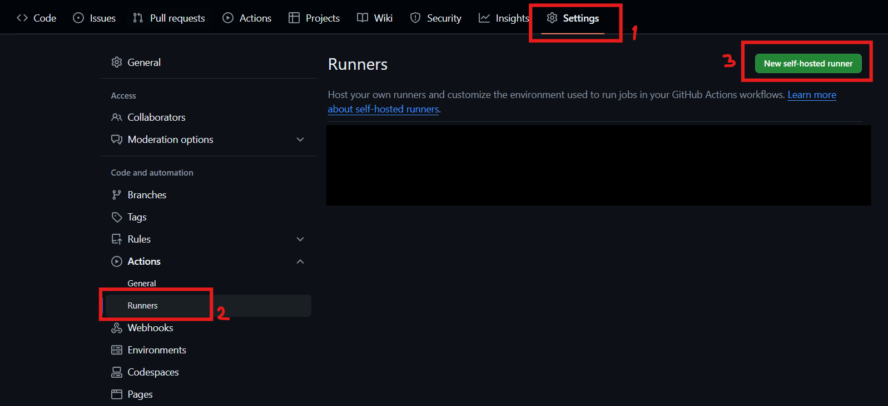
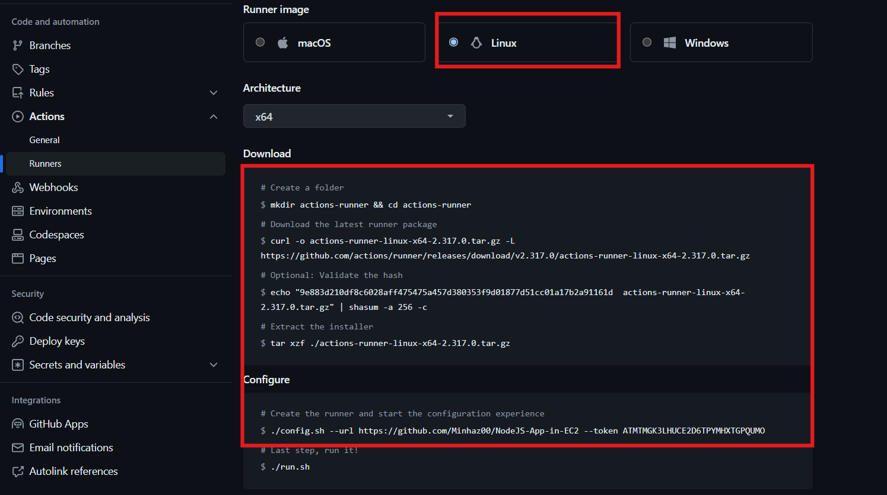
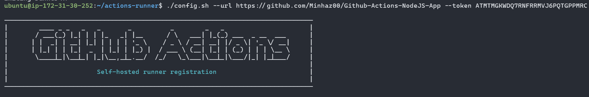
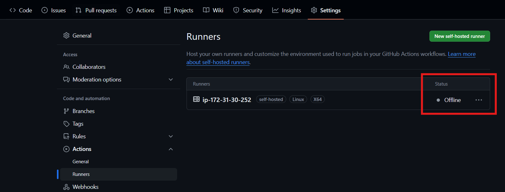
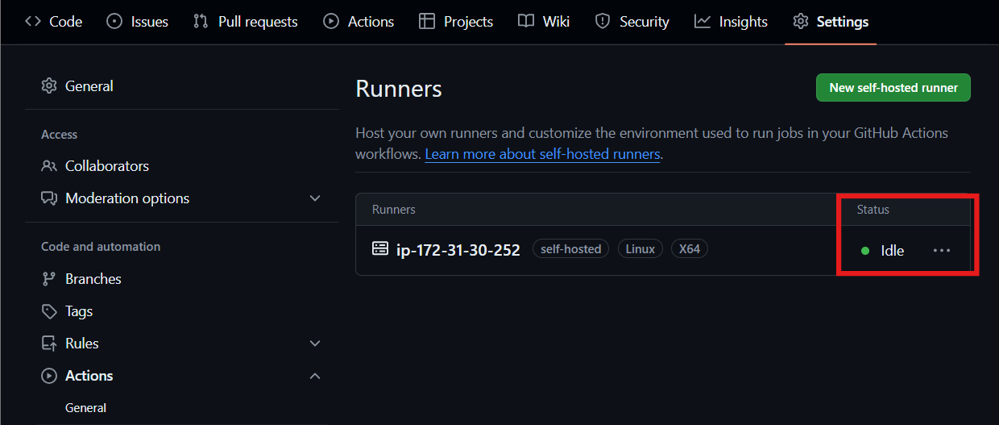
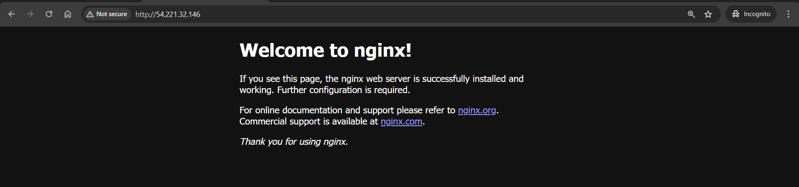
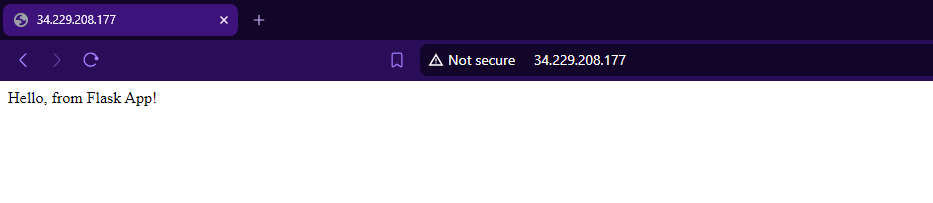
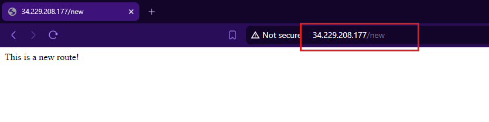

## Setting Up CI/CD Pipeline for Flask Application on AWS EC2 with GitHub Actions

### Project Introduction
This guide walks through the process of setting up a Continuous Integration/Continuous Deployment (CI/CD) pipeline for a Flask application on an AWS EC2 instance using GitHub Actions. The CI/CD pipeline ensures that every change pushed to the GitHub repository is automatically deployed to the EC2 instance, making the deployment process efficient and reliable.


### Prerequisites
- **AWS Account**: Ensure you have an AWS account with permissions to create and manage EC2 instances.
- **GitHub Account**: Ensure you have a GitHub account with a repository for your Flask project.
- **Python 3.12**: Ensure Python 3.12 is installed on your local machine.

### Setup Local Flask Application Project
1. **Create a new directory for your project and navigate to it**:
    ```bash
    mkdir flask-app
    cd flask-app
    ```

2. **Create a virtual environment**:
    ```bash
    python3.12 -m venv venv
    source venv/bin/activate
    ```

3. **Install Flask**:
    ```bash
    pip install flask
    ```

4. **Create `app.py` with the following content**:
    ```python
    from flask import Flask
    app = Flask(__name__)

    @app.route('/')
    def hello():
        return "Hello, from Flask App!"

    if __name__ == '__main__':
        app.run(host='0.0.0.0')
    ```

5. **Deactivate the virtual environment**:
    ```bash
    deactivate
    ```

6. **Create a `.gitignore` file to ignore the `venv` directory**:
    ```bash
    echo "venv/" >> .gitignore
    ```

### Upload it in a GitHub Repository
1. **Initialize a git repository**:
    ```bash
    git init
    ```

2. **Add files and commit**:
    ```bash
    git add .
    git commit -m "Initial commit"
    ```

3. **Create a new repository on GitHub** and push the code:
    ```bash
    git remote add origin https://github.com/your-username/your-repo.git
    git push -u origin main
    ```

### Setup AWS EC2 Instance
1. **Login to AWS Console**: Login to your AWS account.
   
2. **Launch EC2 Instance**:
    - Choose "Ubuntu" as the operating system.
    - Ensure it's a free-tier eligible instance type.
    
    

3. **Create a new key pair or use an existing one**.
   
    

4. **Configure Security Group**:
    - Go to security group > select the one for your instance > Edit inbound rules.
    - Allow SSH (port 22) from your IP.
    - Allow HTTP (port 80) from anywhere.
   
    

### Connect to EC2 Instance
1. **SSH into EC2 Instance**:
    - Go to your instance and click on connect.
    - Open terminal and navigate to the directory with your PEM file.
    - Use the SSH command provided by AWS to connect. 

    ```bash
    ssh -i "your-key-pair.pem" ubuntu@your-ec2-public-ip
    ```

     

### Setup GitHub Actions Runner on EC2
1. **Go to your repository’s settings on GitHub**.
   
2. **Under “Actions”, click “Runners” and add a new self-hosted runner for Linux**.
   
     

3. **Follow the commands provided to set up the runner on your EC2 instance**:

    

    ```bash
    mkdir actions-runner && cd actions-runner
    curl -o actions-runner-linux-x64-2.299.2.tar.gz -L https://github.com/actions/runner/releases/download/v2.299.2/actions-runner-linux-x64-2.299.2.tar.gz
    tar xzf ./actions-runner-linux-x64-2.299.2.tar.gz
    ./config.sh --url https://github.com/your-username/your-repo --token YOUR_RUNNER_TOKEN
    ```
    You will get something like this 

    

    After that, keep hitting Enter to continue with the default settings. Now if you go to the github repository > settings > runners, you will get something like this:

     


4. **Install and start the runner service**:
    ```bash
    sudo ./svc.sh install
    sudo ./svc.sh start
    ```

    

### Setup CI/CD Pipeline with GitHub Actions

Create a GitHub Actions workflow file in your repository (`.github/workflows/main.yml`):

```yaml
name: Flask CI/CD

on:
  push:
    branches: [ "main" ]

jobs:
  build:
    runs-on: self-hosted

    steps:
    - name: Check out the code
      uses: actions/checkout@v4

    - name: Set up Python
      uses: actions/setup-python@v2
      with:
        python-version: '3.12'

    - name: Create and activate virtual environment
      run: |
        python3.12 -m venv venv
        source venv/bin/activate
        pip install flask gunicorn

    - name: Restart Flask App
      run: sudo systemctl restart flask-app
```

#### Explanation of `main.yml`:
1. **name: Flask CI/CD**: This sets the name of the workflow.
2. **on: push: branches: [ "main" ]**: This triggers the workflow every time there is a push to the `main` branch.
3. **jobs: build: runs-on: self-hosted**: This defines a job named `build` that runs on a self-hosted runner.
4. **steps**: This defines the sequence of steps to be executed in the job.
5. **- name: Check out the code**: This step uses the `actions/checkout@v4` action to check out the repository code.
6. **- name: Set up Python**: This step uses the `actions/setup-python@v2` action to set up Python 3.12.
7. **- name: Create and activate virtual environment**: This step creates a virtual environment, activates it, and installs Flask and Gunicorn.
8. **- name: Restart Flask App**: This step restarts the Flask application using `systemctl`.

### Deploy and Verify
   1.   **Push Changes to GitHub**:Commit and push changes to your GitHub repository.
   2.   **Check GitHub Actions**: Ensure the workflow runs successfully and deploys the updated code to your EC2 instance.

If you go to the SSH terminal, you can see _work directory. Now go to _work folder. In this folder you will see your Flask app directory from github. Therefore code updated to your EC2 instance.

### Install Nginx and Setup Proxy on EC2
1. **Install Nginx**:
    ```bash
    sudo apt-get update
    sudo apt-get install -y nginx
    ```
    If you visit http://<ec2-instance-public-ip> you will see:

    


2. **Configure Nginx to proxy requests to the Flask application**:
    ```bash
    sudo nano /etc/nginx/sites-available/default
    ```

    Add the following content:
    ```nginx
    server {
        listen 80;
        server_name _;

        location / {
            proxy_pass http://127.0.0.1:5000;
            proxy_set_header Host $host;
            proxy_set_header X-Real-IP $remote_addr;
            proxy_set_header X-Forwarded-For $proxy_add_x_forwarded_for;
            proxy_set_header X-Forwarded-Proto $scheme;
        }
    }
    ```

3. **Test the Nginx configuration and restart the service**:
    ```bash
    sudo nginx -t
    sudo systemctl restart nginx
    ```

### Configure the Flask Application as a Systemd Service

#### Why We Need Systemd Service:
1. **Automatic Startup**: Systemd ensures the Flask application starts automatically when the server boots up.
2. **Monitoring and Restart**: Systemd monitors the Flask application and restarts it if it crashes, ensuring high availability.
3. **Unified Logging**: Systemd logs service activity, aiding in troubleshooting and performance monitoring.
4. **Dependency Management**: Systemd manages dependencies, ensuring that services start in the correct order.
5. **Resource Management**: Systemd can manage resource limits for the Flask application, ensuring it runs efficiently without exhausting system resources.

1. **Create a systemd service file for Flask**:
    ```bash
    sudo nano /etc/systemd/system/flask-app.service
    ```

    Add the following content:
    ```ini
    [Unit]
    Description=Flask instance to serve Flask app
    After=network.target

    [Service]
    User=ubuntu
    Group=www-data
    WorkingDirectory=/home/ubuntu/actions-runner/_work/Flask-app-with-github-action/Flask-app-with-github-action
    Environment="PATH=/home/ubuntu/actions-runner/_work/Flask-app-with-github-action/Flask-app-with-github-action/venv/bin"
    ExecStart=/home/ubuntu/actions-runner/_work/Flask-app-with-github-action/Flask-app-with-github-action/venv/bin/python /home/ubuntu/actions-runner/_work/Flask-app-with-github-action/Flask-app-with-github-action/app.py

    [Install]
    WantedBy=multi-user.target
    ```

2. **Reload systemd to apply the changes**:
    ```bash
    sudo systemctl daemon-reload
    sudo systemctl start flask-app
    sudo systemctl enable flask-app
    ```

### Restart Nginx
1. **Restart Nginx to apply any configuration changes**:
    ```bash
    sudo systemctl restart nginx
    ```

### Verify Deployment
1. **Verify the current app**:
    - Visit `http://<ec2-instance-public-ip>` to see output the output

    

2. **Update `app.py` to add a new route**:
    ```python
    from flask import Flask
    app = Flask(__name__)

    @app.route('/')
    def hello():
        return "Hello, from Flask App updated!"

    @app.route('/new')
    def new_route():
        return "This is a new route!"

    if __name__ == '__main__':
        app.run(host='0.0.0.0')
    ```

3. **Push changes to GitHub**:
    ```bash
    git add .
    git commit -m "Update Flask app with new route"
    git push
    ```

4. **Check GitHub Actions**: Ensure the workflow runs successfully and deploys the updated code to your EC2 instance.

5. **Verify the new deployment**:
    - Visit `http://<ec2-instance-public-ip>` to see "Hello, from Flask App updated!".
    - Visit `http://<ec2-instance-public-ip>/new` to see "This is a new route!".

    

By following these steps, you will set up a CI/CD pipeline for a Flask application using GitHub Actions and deploy it to an AWS EC2 instance with Nginx as a reverse proxy. This ensures that every change pushed to the GitHub repository is automatically deployed to the EC2 instance.